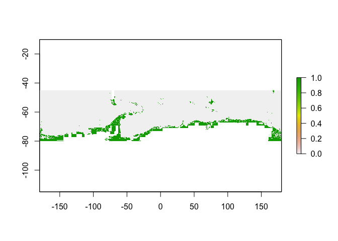

practical
================

## Occurrence data

Explore occurrence
records

``` r
occ.sterechinus <- read.csv("data/occurrences_sterechinus.csv", header=T, sep=";")
head(occ.sterechinus)
```

    ##   decimalLatitude decimalLongitude
    ## 1       -77.85000         166.6667
    ## 2       -77.83333         166.5667
    ## 3       -77.83330         166.5000
    ## 4       -77.83330         166.5500
    ## 5       -77.67000         -35.5000
    ## 6       -77.66667         -35.5000

``` r
continent <- read.csv("data/worldmap.csv") # add continents lines
ggplot(occ.sterechinus, aes(x=decimalLongitude, y=decimalLatitude)) +
  geom_point(stat="identity", colour="blue", alpha=0.5) 
```

<!-- -->

``` r
  # geom_polygon(continent, aes(x=lon, y=lat), fill=NA) 
```

## Environmental layers

``` r
depth <- raster("data/environmental_layers/depth.nc")
geomorphology <- raster("data/environmental_layers/geomorphology.nc")
ice_cover_min <- raster("data/environmental_layers/ice_cover_min.nc")
ice_cover_max <- raster("data/environmental_layers/ice_cover_max.nc")
ice_thickness_min <- raster("data/environmental_layers/ice_thickness_min.nc")
ice_thickness_max <- raster("data/environmental_layers/ice_thickness_max.nc")
mixed_layer_depth <- raster("data/environmental_layers/mixed_layer_depth.nc")
POC_2005_2012_min <- raster("data/environmental_layers/POC_2005_2012_min.nc")
POC_2005_2012_max <- raster("data/environmental_layers/POC_2005_2012_max.nc")
roughness <- raster("data/environmental_layers/roughness.nc")
sediments <- raster("data/environmental_layers/sediments.nc")
seafloor_current_speed <- raster("data/environmental_layers/seafloor_current_speed.nc")
seafloor_sali_2005_2012_min <- raster("data/environmental_layers/seafloor_sali_2005_2012_min.nc")
seafloor_sali_2005_2012_max <- raster("data/environmental_layers/seafloor_sali_2005_2012_max.nc")
seafloor_temp_2005_2012_min <- raster("data/environmental_layers/seafloor_temp_2005_2012_min.nc")
seafloor_temp_2005_2012_max <- raster("data/environmental_layers/seafloor_temp_2005_2012_max.nc")
slope <- raster("data/environmental_layers/slope.nc")

predictors_stack <- stack(depth, geomorphology,ice_cover_min, ice_cover_max, ice_thickness_min, ice_thickness_max, mixed_layer_depth, POC_2005_2012_min, POC_2005_2012_max, roughness, sediments, seafloor_current_speed, seafloor_sali_2005_2012_min, seafloor_sali_2005_2012_max, seafloor_temp_2005_2012_min, seafloor_temp_2005_2012_max, slope)
```

## Pixel resolution of environmental layers

Convert pixel resolution of `predictors_stack` with `raster::aggregate`.
Choices: 0.1, 1, 10?

``` r
# check current pixel resolution of predictors_stack
predictors_stack_5 <- aggregate(predictors_stack, fact=5)
predictors_stack_10 <- aggregate(predictors_stack, fact=10)
plot(predictors_stack$depth)
```

<!-- -->

``` r
plot(predictors_stack_5$depth)
```

<!-- -->

``` r
plot(predictors_stack_10$depth)
```

<!-- -->

``` r
# pass predictors_stack to run() function
source("scripts/run_yOur_SDM.R")
res_1 <- run(predictors_stack, 0.1)
```

    ## 
    ##  
    ##  GBM STEP - version 2.9 
    ##  
    ## Performing cross-validation optimisation of a boosted regression tree model 
    ## for id and using a family of bernoulli 
    ## Using 1240 observations and 15 predictors 
    ## loading user-supplied fold vector 
    ## creating 4 initial models of 50 trees 
    ## 
    ##  folds are stratified by prevalence 
    ## total mean deviance =  0.9827 
    ## tolerance is fixed at  0.001 
    ## ntrees resid. dev. 
    ## 50    0.687 
    ## now adding trees... 
    ## 100   0.5771 
    ## 150   0.5199 
    ## 200   0.4909 
    ## 250   0.4768 
    ## 300   0.468 
    ## 350   0.4628 
    ## 400   0.4592 
    ## 450   0.4563 
    ## 500   0.4565 
    ## 550   0.4565 
    ## 600   0.4557 
    ## 650   0.4557 
    ## 700   0.4568 
    ## 750   0.4581 
    ## 800   0.4606 
    ## 850   0.4614 
    ## 900   0.4632 
    ## 950   0.4645 
    ## 1000   0.4668 
    ## 1050   0.4692 
    ## 1100   0.4719 
    ## 1150   0.4737

    ## fitting final gbm model with a fixed number of 650 trees for id

<!-- -->

    ## 
    ## mean total deviance = 0.983 
    ## mean residual deviance = 0.313 
    ##  
    ## estimated cv deviance = 0.456 ; se = 0.064 
    ##  
    ## training data correlation = 0.851 
    ## cv correlation =  0.717 ; se = 0.029 
    ##  
    ## training data AUC score = 0.983 
    ## cv AUC score = 0.949 ; se = 0.009 
    ##  
    ## elapsed time -  0.11 minutes 
    ## 
    ##  
    ##  GBM STEP - version 2.9 
    ##  
    ## Performing cross-validation optimisation of a boosted regression tree model 
    ## for id and using a family of bernoulli 
    ## Using 1240 observations and 15 predictors 
    ## loading user-supplied fold vector 
    ## creating 4 initial models of 50 trees 
    ## 
    ##  folds are stratified by prevalence 
    ## total mean deviance =  0.9827 
    ## tolerance is fixed at  0.001 
    ## ntrees resid. dev. 
    ## 50    0.7 
    ## now adding trees... 
    ## 100   0.5955 
    ## 150   0.5426 
    ## 200   0.5137 
    ## 250   0.4993 
    ## 300   0.4913 
    ## 350   0.4852 
    ## 400   0.4806 
    ## 450   0.4781 
    ## 500   0.476 
    ## 550   0.4736 
    ## 600   0.4718 
    ## 650   0.4709 
    ## 700   0.4708 
    ## 750   0.472 
    ## 800   0.4716 
    ## 850   0.4722 
    ## 900   0.4733 
    ## 950   0.4737 
    ## 1000   0.4751 
    ## 1050   0.4767 
    ## 1100   0.478 
    ## 1150   0.479 
    ## 1200   0.4812 
    ## 1250   0.4817

    ## fitting final gbm model with a fixed number of 700 trees for id

<!-- -->

    ## 
    ## mean total deviance = 0.983 
    ## mean residual deviance = 0.292 
    ##  
    ## estimated cv deviance = 0.471 ; se = 0.062 
    ##  
    ## training data correlation = 0.866 
    ## cv correlation =  0.71 ; se = 0.024 
    ##  
    ## training data AUC score = 0.987 
    ## cv AUC score = 0.945 ; se = 0.01 
    ##  
    ## elapsed time -  0.1 minutes 
    ## 
    ##  
    ##  GBM STEP - version 2.9 
    ##  
    ## Performing cross-validation optimisation of a boosted regression tree model 
    ## for id and using a family of bernoulli 
    ## Using 1240 observations and 15 predictors 
    ## loading user-supplied fold vector 
    ## creating 4 initial models of 50 trees 
    ## 
    ##  folds are stratified by prevalence 
    ## total mean deviance =  0.9827 
    ## tolerance is fixed at  0.001 
    ## ntrees resid. dev. 
    ## 50    0.6971 
    ## now adding trees... 
    ## 100   0.5885 
    ## 150   0.5365 
    ## 200   0.5097 
    ## 250   0.493 
    ## 300   0.4839 
    ## 350   0.4784 
    ## 400   0.4755 
    ## 450   0.4735 
    ## 500   0.4727 
    ## 550   0.4713 
    ## 600   0.4714 
    ## 650   0.4721 
    ## 700   0.472 
    ## 750   0.4728 
    ## 800   0.4742 
    ## 850   0.4749 
    ## 900   0.4761 
    ## 950   0.4773 
    ## 1000   0.4795 
    ## 1050   0.4809 
    ## 1100   0.4826 
    ## 1150   0.4833 
    ## 1200   0.4855

    ## fitting final gbm model with a fixed number of 550 trees for id

<!-- -->

    ## 
    ## mean total deviance = 0.983 
    ## mean residual deviance = 0.32 
    ##  
    ## estimated cv deviance = 0.471 ; se = 0.035 
    ##  
    ## training data correlation = 0.848 
    ## cv correlation =  0.709 ; se = 0.014 
    ##  
    ## training data AUC score = 0.982 
    ## cv AUC score = 0.944 ; se = 0.006 
    ##  
    ## elapsed time -  0.09 minutes 
    ## 
    ##  
    ##  GBM STEP - version 2.9 
    ##  
    ## Performing cross-validation optimisation of a boosted regression tree model 
    ## for id and using a family of bernoulli 
    ## Using 1240 observations and 15 predictors 
    ## loading user-supplied fold vector 
    ## creating 4 initial models of 50 trees 
    ## 
    ##  folds are stratified by prevalence 
    ## total mean deviance =  0.9827 
    ## tolerance is fixed at  0.001 
    ## ntrees resid. dev. 
    ## 50    0.7376 
    ## now adding trees... 
    ## 100   0.6343 
    ## 150   0.5842 
    ## 200   0.5577 
    ## 250   0.5444 
    ## 300   0.5364 
    ## 350   0.534 
    ## 400   0.5324 
    ## 450   0.5321 
    ## 500   0.5319 
    ## 550   0.5322 
    ## 600   0.5325 
    ## 650   0.533 
    ## 700   0.5347 
    ## 750   0.5361 
    ## 800   0.5374 
    ## 850   0.5385 
    ## 900   0.539 
    ## 950   0.5407 
    ## 1000   0.5436 
    ## 1050   0.5456 
    ## 1100   0.5478 
    ## 1150   0.5496

    ## fitting final gbm model with a fixed number of 500 trees for id

<!-- -->

    ## 
    ## mean total deviance = 0.983 
    ## mean residual deviance = 0.357 
    ##  
    ## estimated cv deviance = 0.532 ; se = 0.033 
    ##  
    ## training data correlation = 0.825 
    ## cv correlation =  0.667 ; se = 0.026 
    ##  
    ## training data AUC score = 0.977 
    ## cv AUC score = 0.929 ; se = 0.007 
    ##  
    ## elapsed time -  0.29 minutes 
    ## 
    ##  
    ##  GBM STEP - version 2.9 
    ##  
    ## Performing cross-validation optimisation of a boosted regression tree model 
    ## for id and using a family of bernoulli 
    ## Using 1240 observations and 15 predictors 
    ## loading user-supplied fold vector 
    ## creating 4 initial models of 50 trees 
    ## 
    ##  folds are stratified by prevalence 
    ## total mean deviance =  0.9827 
    ## tolerance is fixed at  0.001 
    ## ntrees resid. dev. 
    ## 50    0.7683 
    ## now adding trees... 
    ## 100   0.6434 
    ## 150   0.584 
    ## 200   0.5565 
    ## 250   0.5454 
    ## 300   0.5393 
    ## 350   0.5354 
    ## 400   0.5319 
    ## 450   0.5301 
    ## 500   0.5279 
    ## 550   0.5261 
    ## 600   0.5259 
    ## 650   0.5268 
    ## 700   0.5271 
    ## 750   0.5303 
    ## 800   0.5312 
    ## 850   0.5342 
    ## 900   0.5359 
    ## 950   0.5372 
    ## 1000   0.5381 
    ## 1050   0.539 
    ## 1100   0.5411 
    ## 1150   0.5435

    ## fitting final gbm model with a fixed number of 600 trees for id

<!-- -->

    ## 
    ## mean total deviance = 0.983 
    ## mean residual deviance = 0.324 
    ##  
    ## estimated cv deviance = 0.526 ; se = 0.024 
    ##  
    ## training data correlation = 0.844 
    ## cv correlation =  0.724 ; se = 0.021 
    ##  
    ## training data AUC score = 0.982 
    ## cv AUC score = 0.942 ; se = 0.004 
    ##  
    ## elapsed time -  0.2 minutes

<!-- --><!-- -->

``` r
res_5 <- run(predictors_stack_5, 0.5)
```

    ## 
    ##  
    ##  GBM STEP - version 2.9 
    ##  
    ## Performing cross-validation optimisation of a boosted regression tree model 
    ## for id and using a family of bernoulli 
    ## Using 1155 observations and 17 predictors 
    ## loading user-supplied fold vector 
    ## creating 4 initial models of 50 trees 
    ## 
    ##  folds are stratified by prevalence 
    ## total mean deviance =  0.7886 
    ## tolerance is fixed at  8e-04 
    ## ntrees resid. dev. 
    ## 50    0.613 
    ## now adding trees... 
    ## 100   0.5395 
    ## 150   0.5079 
    ## 200   0.4954 
    ## 250   0.4896 
    ## 300   0.4875 
    ## 350   0.4875 
    ## 400   0.489 
    ## 450   0.4917 
    ## 500   0.4954 
    ## 550   0.4981 
    ## 600   0.5021 
    ## 650   0.5056 
    ## 700   0.5086 
    ## 750   0.5128 
    ## 800   0.5183 
    ## 850   0.523 
    ## 900   0.5274 
    ## 950   0.5303 
    ## 1000   0.5342

    ## fitting final gbm model with a fixed number of 300 trees for id

<!-- -->

    ## 
    ## mean total deviance = 0.789 
    ## mean residual deviance = 0.365 
    ##  
    ## estimated cv deviance = 0.487 ; se = 0.046 
    ##  
    ## training data correlation = 0.737 
    ## cv correlation =  0.544 ; se = 0.052 
    ##  
    ## training data AUC score = 0.964 
    ## cv AUC score = 0.915 ; se = 0.014 
    ##  
    ## elapsed time -  0.09 minutes 
    ## 
    ##  
    ##  GBM STEP - version 2.9 
    ##  
    ## Performing cross-validation optimisation of a boosted regression tree model 
    ## for id and using a family of bernoulli 
    ## Using 1155 observations and 17 predictors 
    ## loading user-supplied fold vector 
    ## creating 4 initial models of 50 trees 
    ## 
    ##  folds are stratified by prevalence 
    ## total mean deviance =  0.7886 
    ## tolerance is fixed at  8e-04 
    ## ntrees resid. dev. 
    ## 50    0.6017 
    ## now adding trees... 
    ## 100   0.527 
    ## 150   0.4916 
    ## 200   0.4745 
    ## 250   0.4656 
    ## 300   0.4609 
    ## 350   0.4579 
    ## 400   0.4564 
    ## 450   0.456 
    ## 500   0.4564 
    ## 550   0.4582 
    ## 600   0.459 
    ## 650   0.46 
    ## 700   0.4617 
    ## 750   0.4626 
    ## 800   0.4641 
    ## 850   0.4654 
    ## 900   0.4684 
    ## 950   0.4706 
    ## 1000   0.4728 
    ## 1050   0.4746 
    ## 1100   0.4766

    ## fitting final gbm model with a fixed number of 450 trees for id

<!-- -->

    ## 
    ## mean total deviance = 0.789 
    ## mean residual deviance = 0.317 
    ##  
    ## estimated cv deviance = 0.456 ; se = 0.069 
    ##  
    ## training data correlation = 0.785 
    ## cv correlation =  0.612 ; se = 0.047 
    ##  
    ## training data AUC score = 0.974 
    ## cv AUC score = 0.932 ; se = 0.014 
    ##  
    ## elapsed time -  0.1 minutes 
    ## 
    ##  
    ##  GBM STEP - version 2.9 
    ##  
    ## Performing cross-validation optimisation of a boosted regression tree model 
    ## for id and using a family of bernoulli 
    ## Using 1155 observations and 17 predictors 
    ## loading user-supplied fold vector 
    ## creating 4 initial models of 50 trees 
    ## 
    ##  folds are stratified by prevalence 
    ## total mean deviance =  0.7886 
    ## tolerance is fixed at  8e-04 
    ## ntrees resid. dev. 
    ## 50    0.6182 
    ## now adding trees... 
    ## 100   0.5447 
    ## 150   0.5088 
    ## 200   0.4915 
    ## 250   0.4824 
    ## 300   0.4779 
    ## 350   0.4756 
    ## 400   0.4747 
    ## 450   0.4743 
    ## 500   0.4749 
    ## 550   0.4766 
    ## 600   0.4786 
    ## 650   0.4795 
    ## 700   0.481 
    ## 750   0.4832 
    ## 800   0.4845 
    ## 850   0.4862 
    ## 900   0.4881 
    ## 950   0.4898 
    ## 1000   0.4921 
    ## 1050   0.4945 
    ## 1100   0.4966

    ## fitting final gbm model with a fixed number of 450 trees for id

<!-- -->

    ## 
    ## mean total deviance = 0.789 
    ## mean residual deviance = 0.315 
    ##  
    ## estimated cv deviance = 0.474 ; se = 0.018 
    ##  
    ## training data correlation = 0.792 
    ## cv correlation =  0.555 ; se = 0.048 
    ##  
    ## training data AUC score = 0.975 
    ## cv AUC score = 0.912 ; se = 0.013 
    ##  
    ## elapsed time -  0.09 minutes 
    ## 
    ##  
    ##  GBM STEP - version 2.9 
    ##  
    ## Performing cross-validation optimisation of a boosted regression tree model 
    ## for id and using a family of bernoulli 
    ## Using 1155 observations and 17 predictors 
    ## loading user-supplied fold vector 
    ## creating 4 initial models of 50 trees 
    ## 
    ##  folds are stratified by prevalence 
    ## total mean deviance =  0.7886 
    ## tolerance is fixed at  8e-04 
    ## ntrees resid. dev. 
    ## 50    0.6312 
    ## now adding trees... 
    ## 100   0.5648 
    ## 150   0.5342 
    ## 200   0.5216 
    ## 250   0.5183 
    ## 300   0.5163 
    ## 350   0.515 
    ## 400   0.5154 
    ## 450   0.5165 
    ## 500   0.5177 
    ## 550   0.5187 
    ## 600   0.5211 
    ## 650   0.5214 
    ## 700   0.5231 
    ## 750   0.5253 
    ## 800   0.5276 
    ## 850   0.5292 
    ## 900   0.5314 
    ## 950   0.5335 
    ## 1000   0.5366 
    ## 1050   0.5392

    ## fitting final gbm model with a fixed number of 350 trees for id

<!-- -->

    ## 
    ## mean total deviance = 0.789 
    ## mean residual deviance = 0.366 
    ##  
    ## estimated cv deviance = 0.515 ; se = 0.023 
    ##  
    ## training data correlation = 0.74 
    ## cv correlation =  0.533 ; se = 0.057 
    ##  
    ## training data AUC score = 0.964 
    ## cv AUC score = 0.9 ; se = 0.017 
    ##  
    ## elapsed time -  0.09 minutes 
    ## 
    ##  
    ##  GBM STEP - version 2.9 
    ##  
    ## Performing cross-validation optimisation of a boosted regression tree model 
    ## for id and using a family of bernoulli 
    ## Using 1155 observations and 17 predictors 
    ## loading user-supplied fold vector 
    ## creating 4 initial models of 50 trees 
    ## 
    ##  folds are stratified by prevalence 
    ## total mean deviance =  0.7886 
    ## tolerance is fixed at  8e-04 
    ## ntrees resid. dev. 
    ## 50    0.6723 
    ## now adding trees... 
    ## 100   0.5903 
    ## 150   0.5537 
    ## 200   0.5388 
    ## 250   0.5346 
    ## 300   0.531 
    ## 350   0.5308 
    ## 400   0.5326 
    ## 450   0.5346 
    ## 500   0.5373 
    ## 550   0.5381 
    ## 600   0.5418 
    ## 650   0.5432 
    ## 700   0.5452 
    ## 750   0.5485 
    ## 800   0.5526 
    ## 850   0.5561 
    ## 900   0.5588 
    ## 950   0.563 
    ## 1000   0.5653 
    ## 1050   0.5677

    ## fitting final gbm model with a fixed number of 350 trees for id

<!-- -->

    ## 
    ## mean total deviance = 0.789 
    ## mean residual deviance = 0.367 
    ##  
    ## estimated cv deviance = 0.531 ; se = 0.067 
    ##  
    ## training data correlation = 0.738 
    ## cv correlation =  0.556 ; se = 0.048 
    ##  
    ## training data AUC score = 0.964 
    ## cv AUC score = 0.906 ; se = 0.014 
    ##  
    ## elapsed time -  0.09 minutes

<!-- --><!-- -->

``` r
res_10 <- run(predictors_stack_10, 1)
```

    ## 
    ##  
    ##  GBM STEP - version 2.9 
    ##  
    ## Performing cross-validation optimisation of a boosted regression tree model 
    ## for id and using a family of bernoulli 
    ## Using 1110 observations and 17 predictors 
    ## loading user-supplied fold vector 
    ## creating 4 initial models of 50 trees 
    ## 
    ##  folds are stratified by prevalence 
    ## total mean deviance =  0.6462 
    ## tolerance is fixed at  6e-04 
    ## ntrees resid. dev. 
    ## 50    0.5331 
    ## now adding trees... 
    ## 100   0.4765 
    ## 150   0.4503 
    ## 200   0.441 
    ## 250   0.4382 
    ## 300   0.4373 
    ## 350   0.4379 
    ## 400   0.438 
    ## 450   0.4389 
    ## 500   0.4404 
    ## 550   0.4409 
    ## 600   0.4422 
    ## 650   0.444 
    ## 700   0.4453 
    ## 750   0.4466 
    ## 800   0.4482 
    ## 850   0.4508 
    ## 900   0.4534 
    ## 950   0.456 
    ## 1000   0.4583 
    ## 1050   0.4616

    ## fitting final gbm model with a fixed number of 300 trees for id

<!-- -->

    ## 
    ## mean total deviance = 0.646 
    ## mean residual deviance = 0.337 
    ##  
    ## estimated cv deviance = 0.437 ; se = 0.041 
    ##  
    ## training data correlation = 0.672 
    ## cv correlation =  0.49 ; se = 0.036 
    ##  
    ## training data AUC score = 0.957 
    ## cv AUC score = 0.907 ; se = 0.021 
    ##  
    ## elapsed time -  0.09 minutes 
    ## 
    ##  
    ##  GBM STEP - version 2.9 
    ##  
    ## Performing cross-validation optimisation of a boosted regression tree model 
    ## for id and using a family of bernoulli 
    ## Using 1110 observations and 17 predictors 
    ## loading user-supplied fold vector 
    ## creating 4 initial models of 50 trees 
    ## 
    ##  folds are stratified by prevalence 
    ## total mean deviance =  0.6462 
    ## tolerance is fixed at  6e-04 
    ## ntrees resid. dev. 
    ## 50    0.515 
    ## now adding trees... 
    ## 100   0.4707 
    ## 150   0.4537 
    ## 200   0.4485 
    ## 250   0.4493 
    ## 300   0.4502 
    ## 350   0.4533 
    ## 400   0.456 
    ## 450   0.4605 
    ## 500   0.4645 
    ## 550   0.4697 
    ## 600   0.4735 
    ## 650   0.4784 
    ## 700   0.4827 
    ## 750   0.4881 
    ## 800   0.4936 
    ## 850   0.4998 
    ## 900   0.5054 
    ## 950   0.51 
    ## 1000   0.5141

    ## fitting final gbm model with a fixed number of 200 trees for id

<!-- -->

    ## 
    ## mean total deviance = 0.646 
    ## mean residual deviance = 0.362 
    ##  
    ## estimated cv deviance = 0.449 ; se = 0.045 
    ##  
    ## training data correlation = 0.665 
    ## cv correlation =  0.46 ; se = 0.049 
    ##  
    ## training data AUC score = 0.95 
    ## cv AUC score = 0.902 ; se = 0.015 
    ##  
    ## elapsed time -  0.08 minutes 
    ## 
    ##  
    ##  GBM STEP - version 2.9 
    ##  
    ## Performing cross-validation optimisation of a boosted regression tree model 
    ## for id and using a family of bernoulli 
    ## Using 1110 observations and 17 predictors 
    ## loading user-supplied fold vector 
    ## creating 4 initial models of 50 trees 
    ## 
    ##  folds are stratified by prevalence 
    ## total mean deviance =  0.6462 
    ## tolerance is fixed at  6e-04 
    ## ntrees resid. dev. 
    ## 50    0.5295 
    ## now adding trees... 
    ## 100   0.4863 
    ## 150   0.4677 
    ## 200   0.4598 
    ## 250   0.4568 
    ## 300   0.4562 
    ## 350   0.4574 
    ## 400   0.4586 
    ## 450   0.4596 
    ## 500   0.4627 
    ## 550   0.4658 
    ## 600   0.4691 
    ## 650   0.4722 
    ## 700   0.4758 
    ## 750   0.4794 
    ## 800   0.4837 
    ## 850   0.4877 
    ## 900   0.4915 
    ## 950   0.4948 
    ## 1000   0.4993

    ## fitting final gbm model with a fixed number of 300 trees for id

<!-- -->

    ## 
    ## mean total deviance = 0.646 
    ## mean residual deviance = 0.324 
    ##  
    ## estimated cv deviance = 0.456 ; se = 0.028 
    ##  
    ## training data correlation = 0.703 
    ## cv correlation =  0.404 ; se = 0.021 
    ##  
    ## training data AUC score = 0.961 
    ## cv AUC score = 0.889 ; se = 0.008 
    ##  
    ## elapsed time -  0.11 minutes 
    ## 
    ##  
    ##  GBM STEP - version 2.9 
    ##  
    ## Performing cross-validation optimisation of a boosted regression tree model 
    ## for id and using a family of bernoulli 
    ## Using 1110 observations and 17 predictors 
    ## loading user-supplied fold vector 
    ## creating 4 initial models of 50 trees 
    ## 
    ##  folds are stratified by prevalence 
    ## total mean deviance =  0.6462 
    ## tolerance is fixed at  6e-04 
    ## ntrees resid. dev. 
    ## 50    0.5304 
    ## now adding trees... 
    ## 100   0.4865 
    ## 150   0.468 
    ## 200   0.4612 
    ## 250   0.4589 
    ## 300   0.459 
    ## 350   0.4589 
    ## 400   0.4601 
    ## 450   0.4613 
    ## 500   0.4631 
    ## 550   0.4655 
    ## 600   0.4676 
    ## 650   0.4703 
    ## 700   0.4724 
    ## 750   0.4755 
    ## 800   0.4782 
    ## 850   0.4809 
    ## 900   0.4833 
    ## 950   0.4854 
    ## 1000   0.4892

    ## fitting final gbm model with a fixed number of 350 trees for id

<!-- -->

    ## 
    ## mean total deviance = 0.646 
    ## mean residual deviance = 0.331 
    ##  
    ## estimated cv deviance = 0.459 ; se = 0.025 
    ##  
    ## training data correlation = 0.692 
    ## cv correlation =  0.414 ; se = 0.037 
    ##  
    ## training data AUC score = 0.959 
    ## cv AUC score = 0.89 ; se = 0.01 
    ##  
    ## elapsed time -  0.08 minutes 
    ## 
    ##  
    ##  GBM STEP - version 2.9 
    ##  
    ## Performing cross-validation optimisation of a boosted regression tree model 
    ## for id and using a family of bernoulli 
    ## Using 1110 observations and 17 predictors 
    ## loading user-supplied fold vector 
    ## creating 4 initial models of 50 trees 
    ## 
    ##  folds are stratified by prevalence 
    ## total mean deviance =  0.6462 
    ## tolerance is fixed at  6e-04 
    ## ntrees resid. dev. 
    ## 50    0.5657 
    ## now adding trees... 
    ## 100   0.5209 
    ## 150   0.5074 
    ## 200   0.5039 
    ## 250   0.5056 
    ## 300   0.5063 
    ## 350   0.5099 
    ## 400   0.5147 
    ## 450   0.5185 
    ## 500   0.5256 
    ## 550   0.5305 
    ## 600   0.535 
    ## 650   0.5409 
    ## 700   0.5473 
    ## 750   0.553 
    ## 800   0.5591 
    ## 850   0.5645 
    ## 900   0.5712 
    ## 950   0.577 
    ## 1000   0.5835

    ## fitting final gbm model with a fixed number of 200 trees for id

<!-- -->

    ## 
    ## mean total deviance = 0.646 
    ## mean residual deviance = 0.371 
    ##  
    ## estimated cv deviance = 0.504 ; se = 0.069 
    ##  
    ## training data correlation = 0.636 
    ## cv correlation =  0.386 ; se = 0.048 
    ##  
    ## training data AUC score = 0.947 
    ## cv AUC score = 0.881 ; se = 0.015 
    ##  
    ## elapsed time -  0.09 minutes

<!-- --><!-- -->

## Contribution of environmental descriptors and model evaluation matrix

### Resolution of environmental layers = 0.1 degree

``` r
res_1
```

    ## [[1]]
    ##                                    mean         sd resolution
    ## depth                       17.93066584 6.30737452        0.1
    ## geomorphology                1.23666475 0.15225265        0.1
    ## ice_cover_min                0.13031945 0.11946731        0.1
    ## ice_cover_max               20.34623964 4.23284174        0.1
    ## ice_thickness_min            0.05250484 0.09175831        0.1
    ## ice_thickness_max           10.20308545 2.44476854        0.1
    ## mixed_layer_depth            2.57234834 1.35159512        0.1
    ## POC_2005_2012_min            5.81951532 0.94201316        0.1
    ## POC_2005_2012_max           24.75062066 7.20507256        0.1
    ## roughness                    4.42041792 0.75440803        0.1
    ## sediments                    2.75578110 0.20606420        0.1
    ## seafloor_current_speed       3.69600555 0.80380363        0.1
    ## seafloor_sali_2005_2012_max  0.84214484 0.34326184        0.1
    ## seafloor_temp_2005_2012_max  2.73253998 0.99395465        0.1
    ## slope                        2.51114633 1.02332234        0.1
    ## 
    ## [[2]]
    ##                       [,1]       [,2]       [,3]       [,4]       [,5]
    ## AUC              0.9558000  0.9330000  0.9361000  0.9722000  0.9305000
    ## COR              0.6992987  0.6636518  0.7071519  0.7978194  0.6885880
    ## TSS              0.6833179  0.5692363  0.5963489  0.7602871  0.5137931
    ## maxSSS           0.2857768  0.4591752  0.6050939  0.3014095  0.4262716
    ## valid_test_data 88.4146341 86.6421569 87.7862595 90.6976744 84.9315068
    ## prop_test        9.5833333 70.4166667 12.0833333  7.9166667 12.5000000
    ##                       [,6]       [,7]       [,8]       [,9]      [,10]
    ## AUC              0.9713000  0.9498000  0.9273000  0.9305000  0.9453000
    ## COR              0.7442441  0.7540633  0.6528057  0.6812191  0.7282217
    ## TSS              0.8524668  0.5913978  0.5729266  0.6677165  0.5612270
    ## maxSSS           0.4044831  0.6222833  0.3543146  0.4056526  0.4633763
    ## valid_test_data 91.4893617 87.1794872 86.7224880 89.5966030 86.4321608
    ## prop_test        7.0833333 10.0000000 70.4166667 37.5000000 37.9166667
    ##                      [,11]      [,12]      [,13]      [,14]      [,15]
    ## AUC              0.9427000  0.9592000  0.9362000  0.9396000  0.9085000
    ## COR              0.6898372  0.7377930  0.6842144  0.7190538  0.5963976
    ## TSS              0.6148148  0.7703037  0.6436905  0.5942961  0.4773810
    ## maxSSS           0.5319660  0.3623791  0.3334083  0.4928258  0.4408957
    ## valid_test_data 87.6543210 91.3875598 88.4297521 87.5930521 83.8028169
    ## prop_test       11.2500000 13.3333333 35.0000000 38.3333333 12.5000000
    ##                      [,16]      [,17]      [,18]      [,19]      [,20]
    ## AUC              0.9335000  0.9407000  0.9524000  0.9374000  0.9379000
    ## COR              0.6688055  0.7049988  0.7851446  0.6896559  0.7171650
    ## TSS              0.6799601  0.6382372  0.5873016  0.6559345  0.6397569
    ## maxSSS           0.3999113  0.4908271  0.5040245  0.5137912  0.4746118
    ## valid_test_data 89.0995261 88.7254902 86.6666667 89.0394089 89.0243902
    ## prop_test       14.1666667 15.8333333  7.5000000 61.6666667 15.0000000
    ## 
    ## [[3]]
    ## class      : RasterLayer 
    ## dimensions : 350, 3600, 1260000  (nrow, ncol, ncell)
    ## resolution : 0.1, 0.1  (x, y)
    ## extent     : -180, 180, -80, -45  (xmin, xmax, ymin, ymax)
    ## crs        : +proj=longlat +datum=WGS84 +ellps=WGS84 +towgs84=0,0,0 
    ## source     : memory
    ## names      : layer 
    ## values     : 0.008006955, 0.9354443  (min, max)

### Resolution of environmental layers = 0.5 degree

``` r
res_5
```

    ## [[1]]
    ##                                    mean        sd resolution
    ## depth                       10.80381134 2.8742231        0.5
    ## geomorphology                3.26860209 1.8538621        0.5
    ## ice_cover_min                0.54370916 0.5822279        0.5
    ## ice_cover_max               16.62903592 3.0639111        0.5
    ## ice_thickness_min            0.08254944 0.1566157        0.5
    ## ice_thickness_max            5.84324876 2.9694440        0.5
    ## mixed_layer_depth            2.46116638 1.3024350        0.5
    ## POC_2005_2012_min           11.73551214 1.2181628        0.5
    ## POC_2005_2012_max            8.33908871 2.6920086        0.5
    ## roughness                    3.88893287 1.0378392        0.5
    ## sediments                    1.35549283 0.8029419        0.5
    ## seafloor_current_speed       3.48255732 1.0939352        0.5
    ## seafloor_sali_2005_2012_min  1.30119617 0.2978518        0.5
    ## seafloor_sali_2005_2012_max  1.60745945 0.7258690        0.5
    ## seafloor_temp_2005_2012_min 23.63977120 1.9714162        0.5
    ## seafloor_temp_2005_2012_max  2.44065900 0.8846728        0.5
    ## slope                        2.57720722 1.1005460        0.5
    ## 
    ## [[2]]
    ##                       [,1]       [,2]       [,3]       [,4]       [,5]
    ## AUC              0.9253000  0.8838000  0.9474000  0.9025000  0.9298000
    ## COR              0.4728114  0.4694589  0.6930981  0.5416999  0.6205968
    ## TSS              0.5277934  0.3744476  0.5823504  0.4931931  0.5760234
    ## maxSSS           0.2575246  0.3088234  0.4875744  0.3481678  0.3573431
    ## valid_test_data 88.6666667 85.3562005 90.7692308 88.0341880 90.3448276
    ## prop_test        8.3870968 67.7419355 13.5483871 10.3225806 12.2580645
    ##                       [,6]       [,7]       [,8]       [,9]      [,10]
    ## AUC              0.9692000  0.9277000  0.8993000  0.9348000  0.9332000
    ## COR              0.7157967  0.6252383  0.4870515  0.6103552  0.6463706
    ## TSS              0.8465909  0.4641944  0.4146213  0.5465368  0.4639841
    ## maxSSS           0.2299169  0.4553082  0.3064368  0.3019081  0.4786069
    ## valid_test_data 93.4959350 87.1559633 86.3753213 89.4988067 87.4680307
    ## prop_test        7.0967742 10.9677419 69.6774194 36.1290323 39.3548387
    ##                      [,11]      [,12]      [,13]      [,14]      [,15]
    ## AUC              0.8816000  0.8965000  0.8910000  0.9249000  0.9285000
    ## COR              0.4305915  0.5322620  0.4697218  0.6469330  0.6107952
    ## TSS              0.4148936  0.4656627  0.4240422  0.4871020  0.4513158
    ## maxSSS           0.3581956  0.3312125  0.4572846  0.3718035  0.3210507
    ## valid_test_data 86.7924528 87.6344086 86.8055556 88.1313131 87.0503597
    ## prop_test       11.6129032 12.9032258 31.6129032 41.9354839 12.2580645
    ##                      [,16]      [,17]      [,18]      [,19]      [,20]
    ## AUC              0.8553000  0.9057000  0.8866000  0.8868000  0.9449000
    ## COR              0.4052998  0.4816697  0.5969567  0.4716083  0.6737127
    ## TSS              0.3127054  0.4030303  0.2919255  0.4005150  0.5507246
    ## maxSSS           0.2944930  0.3633542  0.4765223  0.2601740  0.4717304
    ## valid_test_data 84.5744681 86.7403315 80.0000000 86.0557769 89.4409938
    ## prop_test       14.1935484 10.3225806  9.0322581 65.8064516 14.8387097
    ## 
    ## [[3]]
    ## class      : RasterLayer 
    ## dimensions : 70, 720, 50400  (nrow, ncol, ncell)
    ## resolution : 0.5, 0.5  (x, y)
    ## extent     : -180, 180, -80, -45  (xmin, xmax, ymin, ymax)
    ## crs        : +proj=longlat +datum=WGS84 +ellps=WGS84 +towgs84=0,0,0 
    ## source     : memory
    ## names      : layer 
    ## values     : 0.01268114, 0.8276681  (min, max)

### Resolution of environmental layers = 1 degree

``` r
res_10
```

    ## [[1]]
    ##                                    mean         sd resolution
    ## depth                        7.48249755 1.14831614          1
    ## geomorphology                3.32483023 1.28292482          1
    ## ice_cover_min                0.11201692 0.16122426          1
    ## ice_cover_max               15.99739724 3.56467642          1
    ## ice_thickness_min            0.01572824 0.02285746          1
    ## ice_thickness_max            2.67525613 0.92686657          1
    ## mixed_layer_depth            2.46037471 1.22083126          1
    ## POC_2005_2012_min           12.75405193 2.60273364          1
    ## POC_2005_2012_max            9.47624496 3.34485163          1
    ## roughness                    4.06348425 2.73402848          1
    ## sediments                    1.41964428 0.32529654          1
    ## seafloor_current_speed       3.47329277 1.02032336          1
    ## seafloor_sali_2005_2012_min  2.53463823 1.20280390          1
    ## seafloor_sali_2005_2012_max  2.69139564 1.55406583          1
    ## seafloor_temp_2005_2012_min 24.71904550 3.70428264          1
    ## seafloor_temp_2005_2012_max  4.43931403 2.13398417          1
    ## slope                        2.36078740 0.94526338          1
    ## 
    ## [[2]]
    ##                       [,1]       [,2]       [,3]       [,4]       [,5]
    ## AUC              0.9277000  0.8440000  0.9263000  0.9314000  0.9067000
    ## COR              0.4381457  0.4171822  0.5470499  0.5584615  0.4592991
    ## TSS              0.4878864  0.3430017  0.3586674  0.4972244  0.3384615
    ## maxSSS           0.2974081  0.3566528  0.3167858  0.3041680  0.2708770
    ## valid_test_data 90.8450704 88.3241758 87.6923077 90.9090909 88.2758621
    ## prop_test        8.1818182 64.5454545 15.4545455 11.8181818 13.6363636
    ##                       [,6]       [,7]       [,8]       [,9]      [,10]
    ## AUC              0.9252000  0.9191000  0.8589000  0.8975000  0.9021000
    ## COR              0.5138150  0.5443405  0.3242350  0.4576782  0.4135872
    ## TSS              0.4439252  0.5014985  0.2706767  0.3166267  0.2617595
    ## maxSSS           0.3089568  0.2698101  0.2741699  0.3228046  0.2595674
    ## valid_test_data 91.3043478 91.1764706 86.8983957 87.7551020 86.3402062
    ## prop_test        7.2727273 10.0000000 69.0909091 35.4545455 41.8181818
    ##                      [,11]      [,12]      [,13]      [,14]      [,15]
    ## AUC              0.8914000  0.8663000  0.8824000  0.8933000  0.8680000
    ## COR              0.3665335  0.3775202  0.4413070  0.3964108  0.3218061
    ## TSS              0.3408046  0.2264423  0.2879404  0.2392720  0.2842713
    ## maxSSS           0.1864810  0.3413014  0.3093502  0.2688625  0.3101572
    ## valid_test_data 88.5350318 87.2832370 87.6543210 85.7506361 87.5912409
    ## prop_test       10.9090909 11.8181818 32.7272727 40.9090909 10.0000000
    ##                      [,16]      [,17]      [,18]      [,19]      [,20]
    ## AUC              0.9154000  0.9234000  0.8769000  0.8683000  0.8554000
    ## COR              0.4974936  0.4215478  0.4995200  0.3411544  0.2810211
    ## TSS              0.3871196  0.2875000  0.2745098  0.2161728  0.1997636
    ## maxSSS           0.3004659  0.3493357  0.4044633  0.2824855  0.2984920
    ## valid_test_data 89.1428571 88.6904762 85.0000000 85.7538036 84.9056604
    ## prop_test       16.3636364  7.2727273  8.1818182 68.1818182 16.3636364
    ## 
    ## [[3]]
    ## class      : RasterLayer 
    ## dimensions : 35, 360, 12600  (nrow, ncol, ncell)
    ## resolution : 1, 1  (x, y)
    ## extent     : -180, 180, -80, -45  (xmin, xmax, ymin, ymax)
    ## crs        : +proj=longlat +datum=WGS84 +ellps=WGS84 +towgs84=0,0,0 
    ## source     : memory
    ## names      : layer 
    ## values     : 0.0174204, 0.6886522  (min, max)
